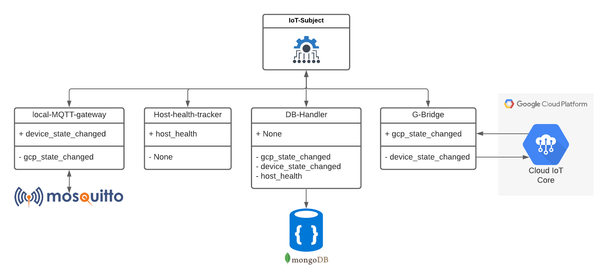

# Home Automation framework
Handles all the communication between my IoT units. It also acts as the link between GCP and my home appliances. 
All IoT units needs to go through the gateway to access the internet. There is one MQTT IoT gateway handling IoT 
traffic. In the future more IoT gateways will be added to handle addition communication protocols
An addition MQTT gateway is present handling traffic going to and from GPC. 

## Architecture

Architectural design made via  [Lucidchart](https://lucid.app/lucidchart/dbce786e-f6e2-41f7-8d71-51f903208ce9/edit?page=0_0#?folder_id=home&browser=icon)

## Run
```bash
pip3 install -r requirements.txt
python3 server.py
```