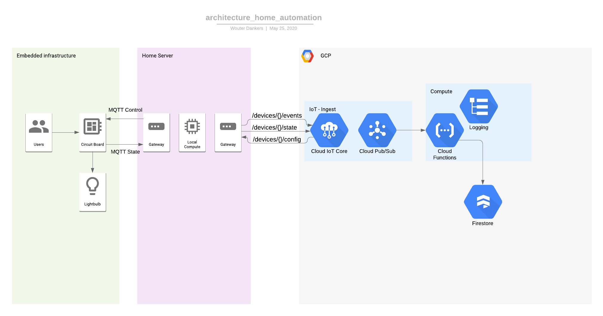

# Home Automation

## Architecture

## Brain storming

### Functionalitty
- visualize energy consumption in the gui via https://energimolnetapi11.docs.apiary.io/#
- show public transport from Hjalmar 
- messure the amount of sun light in the appartment + sun rise
- control all lights
- have an button to turn every thing of + that button has pre set function to select (everything on, cosy mode, etc.)

### Gui 
Andriod app for controlling only (could run locally, onlocal network)
webgui for everything (can be accest form the internet)

- plot with data useage and sunlight
- public transport times 
- calender that shows the routines + add and remove function
- an interactive map of the appartment with controls 
- Show a list of the all connected devices (ip, nac, name, last online, etc.)

### Units
- embedded units: used to control the actors and sensors. Small units that are connected to the local server via Wifi (c++)
- local server: Raspberry pi that is connected to the remote server via the internet. the local server controlles all the embedded units and upload their data to the remote server (python)
- remote server: Runs the webserver (javaScript)
- small touch screen at the entrance that shows the webqui, the overview contains the weather, bus departures, etc. 

### setup
- Andriod app as a gui
- Raspberry PI server
- Particle Photon slaves

### Stages
start with controlling ambiant lights
connect alexa
add more appliences to the circle
